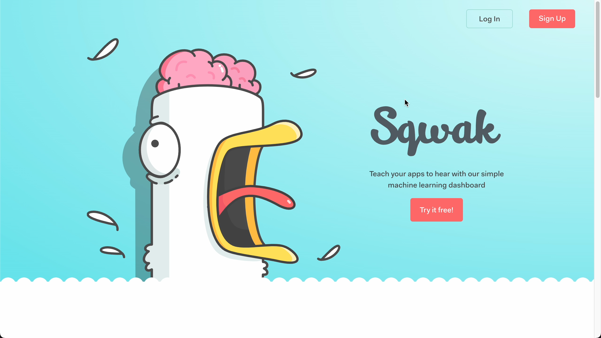

# Sqwak

<div style="display: flex; flex-direction: column;">
  <p>
    Sqwak allows users to train and deploy custom audio-models from a web browser. No coding needed, just upload your audio files and deploy!
  </p>
</div>

[](sqwak-demo.mp4)

<!-- <video width="80%" controls poster="video-poster.png">
  <source src="./sqwak-demo.mp4" type="video/mp4">
  Your browser does not support the video tag.
</video>
<br/>
<br/> -->

### Description

Sqwak lets you create an audio classifier without writing any code!
To train your classifier, create some bins (such as 'clanking' 'quacking' and 'rock music') and upload your music into the appropriate bin.
After that, click the train button and voila, your classifier is now available at an api endpoint.
You can now POST to that endpoint with completely new sounds your classifier has never seen before, and it'll attempt to label it.
<br/>

### How it Works

1. Create a class you want to detect (example: a dog barking)
2. Upload audio files of that sound
3. Click "Train" and Sqwak handles all the audio parsing and training for you.
4. Publish your model to an API endpoint with 1 click.
5. Access your personal endpoint from your product to classify new audio files!

### Local Development

```
yarn install
yarn start
```
